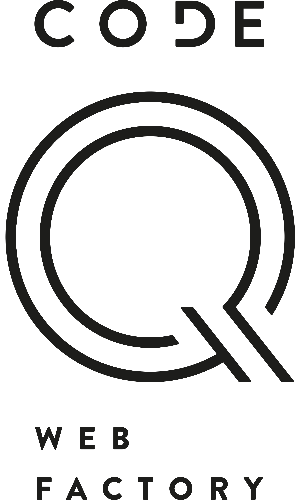

[](https://packagist.org/packages/codeq/passwordprotectedcontent)
[](LICENSE)

# Password Protect Content for Neos CMS

This package allows editors to password protect any document and content NodeType, where the mixin is included.

**Attention:**
This should not be used for content that needs to be strongly protected. We do store the unencrypted passwords in the 
content repository, so that multiple editors can see and change the password. The password is not personalized and
therefore can easily be shared. Also we do not have a brute-force protection in the package.

Limitations:
 - No brute-force protection
 - No session, where the allowed pages is stored

## Installation

CodeQ.HtmlWidget is available via packagist. `"codeq/passwordprotectedcontent" : "~1.0"` to the require section of the 
composer.json or run:

```bash
composer require codeq/passwordprotectedcontent
```

We use semantic-versioning so every breaking change will increase the major-version number.

## Usage

1. Add the mixin `'CodeQ.PasswordProtectedContent:Mixin.Password'` to any NodeType to allow editors to configure a password.
2. Add the following process function to protect the content 
`@process.protect = CodeQ.PasswordProtectedContent:Helper.ProtectContent`
   The process function is not added automatically, because you probably want to render headers and footers of your page. 
   No you can specifically define which content should be rendered and which not.
3. You need to configure your Fusion object to be cached dynamic based on the post parameter like this:
	```neosfusion
	@cache {
		mode = 'dynamic'
		entryIdentifier {
			node = ${node}
		}
		context {
			1 = 'node'
			2 = 'documentNode'
			3 = 'site'
		}
		// cache the initial request ot see the form and don't cache the password-check result
		entryDiscriminator = ${request.httpRequest.methodSafe ? 'static' : false}
	}
	```

### Usage with ContentCollection

To replace the ContentCollection with the password protected form, you will need to get the password from the documentNode and not the ContentCollection node, also you probably do not want to use a separate cache. So apply above @cache to your DocumentNode rendering and render the ContentCollection like this:
```neosfusion
main = Neos.Neos:ContentCollection {
	nodePath = 'main'
	@process.protect = CodeQ.PasswordProtectedContent:Helper.ProtectContent {
		configuredPassword = ${q(documentNode).property('passwordProtectedContentPassword')}
	}
	@cache {
		mode = 'embed'
	}
}
```

### Replacing the default form rendering

You can also replace the form rendering with your own by overriding the prototype:
```neosfusion
prototype(CodeQ.PasswordProtectedContent:Component.PasswordForm) {
	renderer = 'YOUR CODE'
}
```

## License

Licensed under MIT, see [LICENSE](LICENSE)

## Contribution

We will gladly accept contributions. Please send us pull requests.

*The development and the public-releases of this package is generously sponsored [Code Q Web Factory](http://codeq.at).*

[](http://codeq.at)
